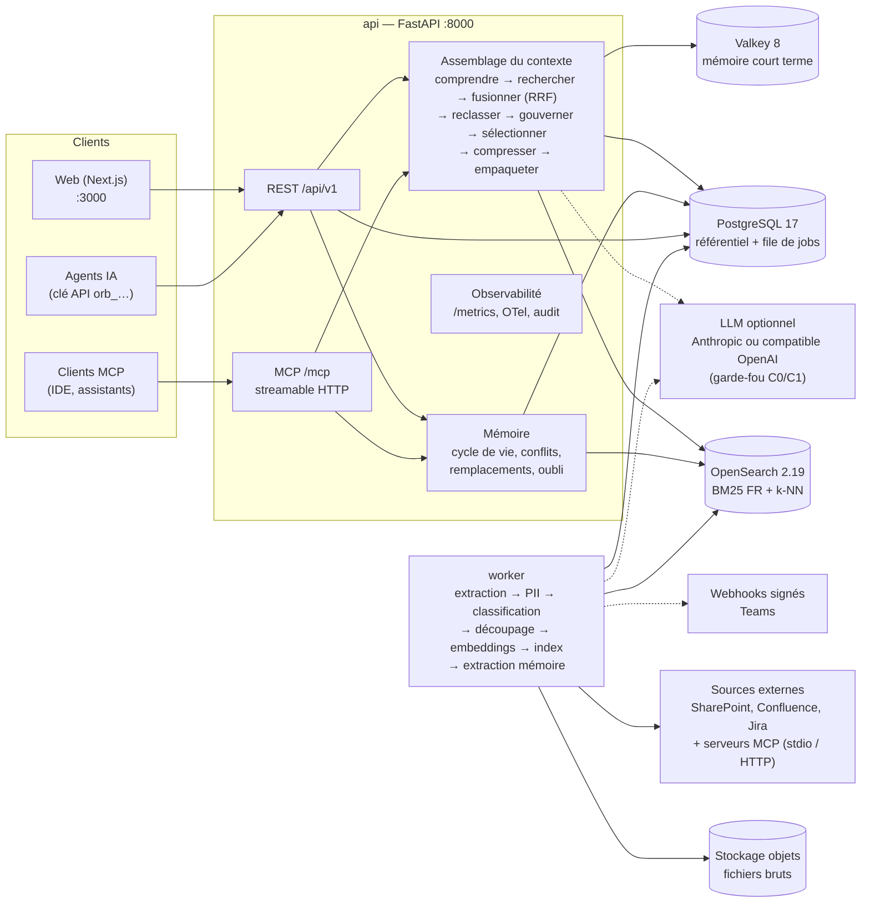

# ORBIT — Plateforme de contexte et de mémoire gouvernée pour agents IA

> **Le bon contexte, au bon agent, au bon moment — et la preuve de pourquoi.**

Les agents IA d'une équipe produit (rédaction de spécifications, design, ingénierie) échouent rarement faute de
modèle : ils échouent faute de **contexte fiable**. Ils citent une décision remplacée depuis un mois, mélangent deux
versions d'une spécification, ignorent une contrainte d'accessibilité ou, pire, exposent un document confidentiel à
un stagiaire.

**ORBIT** est la couche de contexte de l'entreprise pour ses agents :

- **Ingère** les sources de l'équipe (comptes rendus, spécifications versionnées, tickets, CRM, retours
  utilisateurs, traces d'agents, pages web) avec détection et caviardage des **données personnelles**.
- **Construit une mémoire vivante** : décisions, besoins, contraintes, risques et préférences extraits
  automatiquement, avec cycle de vie (proposé → validé → remplacé / obsolète / oublié), versions et provenance
  jusqu'au paragraphe source.
- **Assemble un contexte gouverné** pour chaque tâche d'agent : recherche hybride, fraîcheur, résolution des
  conflits, dédoublonnage, habilitations et ACL, budget de tokens — chaque élément retenu ou exclu porte un
  **code de raison** explicable.
- **Partage un contexte commun** entre agents grâce aux **snapshots** versionnés et comparables (diff).
- **Se branche sur les outils de l'équipe** : connecteurs natifs SharePoint/OneDrive, Confluence et Jira, et
  connecteurs **MCP** (Confluence & Jira, Microsoft 365, Google Workspace, Slack, GitHub, Linear, Obsidian), avec un
  assistant de démarrage en 5 étapes ; MarkItDown convertit PPTX, XLSX, e-mails, EPUB…
- **Fait vivre la mémoire** : *Revue mémoire* (tri des propositions par impact, actions groupées, arbitrage des
  contradictions côte à côte), extraction assistée par **LLM optionnel** (fiches décision avec justification et
  citation vérifiée) et fil des **Changements** avec abonnements et **webhooks** signés.
- **Répond aussi aux humains** : *Demander à ORBIT*, questions-réponses citées sur la mémoire du projet, dans
  l'application ou dans **Microsoft Teams**.
- **Mesure tout** : latence p95, tokens, coût estimé, exclusions par raison, sources les plus utiles, feedback ;
  export NDJSON des traces pour l'évaluation.
- S'intègre à n'importe quel agent via une **API REST** et un **serveur MCP** (streamable HTTP).

Le projet de démonstration **Atlas** (entreprise fictive *Nordalis*) raconte un vrai projet : une décision
« application native » remplacée par une « PWA », une spécification en deux versions, un inventaire qui contredit la
v2, des tickets périmés, un budget classifié **C3 (Secret)**, des fiches CRM **C2 (Confidentiel)** avec données
personnelles caviardées. Le scénario de présentation est décrit dans [`docs/DEMO.md`](docs/DEMO.md).

> ⚠️ **Classification des données.** ORBIT applique la politique de classification C0 (Public) → C3 (Secret).
> Le jeu de démonstration contient volontairement des contenus **C2 — Confidentiel** et **C3 — Secret**
> *entièrement fictifs*. N'y mélangez jamais de vraies données ; l'interface affiche un bandeau d'avertissement dès
> qu'un contenu C2/C3 est ingéré, affiché ou servi.

## Démo en ligne

| URL | Hébergement |
|---|---|
| https://orbit-virid-psi-70.vercel.app | Landing page, puis `/login` (frontend sur **Vercel**) |
| https://api-production-deffe.up.railway.app | API, worker et serveur MCP (sur **Railway**) |

Les identifiants de l'instance en ligne sont **communiqués séparément** : ils ne figurent pas dans ce dépôt (les
mots de passe ci-dessous ne valent que pour une installation locale).

## Parcours dans l’interface

| Section | Entrées | À quoi ça sert |
|---|---|---|
| — | **Vue d'ensemble** | État du projet, éléments à traiter, flux ORBIT (sources → documents → mémoire → décisions → contextes), décisions en vigueur, santé de l'ingestion, activité |
| — | **Demander à ORBIT** (bouton principal) | Questions-réponses citées sur la mémoire du projet |
| Données | Sources · Connecteurs | Contenus ingérés, traitements, connecteurs natifs et MCP |
| Contexte | Mémoire · Contexte · Snapshots | Mémoire et son graphe, explorateur de contexte (retenus / exclus avec raisons), contextes partagés et versionnés |
| Qualité | Revue mémoire · Changements | Validation des propositions, arbitrage des contradictions, fil des changements et webhooks |
| Suivi | Observabilité | Requêtes, latence, tokens, coût, motifs d'exclusion, traces |
| Administration | Paramètres | Projet et politiques, membres, agents, intégration MCP, webhooks, audit |

---

## Architecture



| Service | Rôle | Port hôte |
|---|---|---|
| `web` | Interface Next.js 15 (voir *Parcours dans l’interface*) et landing page | 3000 |
| `api` | FastAPI : REST `/api/v1`, MCP `/mcp`, webhook Teams, `/metrics`, `/health`, `/ready` | 8000 |
| `worker` | Ingestion, synchronisation des connecteurs (natifs et MCP), extraction mémoire, consolidation, oubli sélectif, livraison des webhooks, résumés (file Postgres `SKIP LOCKED`) | — |
| `postgres` | Source de vérité (documents, versions, chunks, mémoire, requêtes, snapshots, audit) | 5433 |
| `opensearch` | Recherche plein texte (analyseur français) + vecteurs k-NN | 9201 |
| `valkey` | Tampon des sessions d'agents (mémoire court terme, TTL) | 6380 |

Le contrat complet (déploiement, modèle d'accès, modèle de données, pipeline, algorithme d'assemblage) est dans
[`docs/ARCHITECTURE.md`](docs/ARCHITECTURE.md) ; les fonctionnalités produit (revue mémoire, changements et webhooks,
extraction LLM, Demander à ORBIT et Teams, connecteurs natifs et MCP) dans [`docs/FEATURES.md`](docs/FEATURES.md).
Les images backend embarquent Node.js et les serveurs MCP en versions figées : aucun code n'est téléchargé à
l'exécution.

---

## Démarrage rapide

Prérequis : Docker (Compose v2) et `make`. Le modèle d'embeddings multilingue est téléchargé au build de l'image
backend ; la plateforme fonctionne ensuite **hors ligne** et **sans LLM**.

```bash
cp .env.example .env      # valeurs de développement
make up                   # construit et démarre toute la plateforme
make seed                 # charge le projet de démonstration « Atlas » via le vrai pipeline
```

`make seed` exécute `python -m app.seed` dans le conteneur `api` : il crée les utilisateurs, le projet, les agents et
les sources, ingère 11 documents (dont une spécification en deux versions) et 28 enregistrements importés
(Jira, CRM, bêta, traces d'agents), attend que le worker ait tout traité, crée la mémoire de démonstration, joue ~30 requêtes de contexte réelles avec leurs feedbacks et
snapshots, puis répartit leurs horodatages sur 14 jours (données de démonstration). Il est **idempotent** ;
`make reseed` (`python -m app.seed --reset`) repart de zéro.

| URL | Description |
|---|---|
| http://localhost:3000 | Interface web |
| http://localhost:8000/api/v1/docs | Documentation OpenAPI interactive |
| http://localhost:8000/mcp | Serveur MCP (streamable HTTP, clé d'agent requise) |
| http://localhost:8000/metrics | Métriques Prometheus |
| http://localhost:8000/health · `/ready` | Sondes de vie et de disponibilité |

### Comptes de démonstration (installation locale)

| Personne | Email | Mot de passe | Rôle projet | Habilitation |
|---|---|---|---|---|
| Admin ORBIT | `admin@orbit.local` | `orbit-admin` | admin plateforme | C3 |
| Camille Martin — Product Owner | `camille.martin@nordalis.example` | `orbit-demo` | owner | C2 |
| Léo Bernard — Product Designer | `leo.bernard@nordalis.example` | `orbit-demo` | editor | C1 |
| Inès Moreau — Lead Engineer | `ines.moreau@nordalis.example` | `orbit-demo` | editor | C2 |
| Sarah Nguyen — Analyste (stagiaire) | `sarah.nguyen@nordalis.example` | `orbit-demo` | viewer | C1 |

Les clés des trois agents (`Agent Produit` C2, `Agent Design` C1, `Agent Engineering` C2) sont affichées à la fin du
seed et écrites dans `backend/.seed-agents.json` (fichier local, à ne pas versionner).

### Autres commandes

| Commande | Effet |
|---|---|
| `make logs` / `make ps` | Journaux / état des services |
| `make down` | Arrête la plateforme (volumes conservés) |
| `make reset` | Détruit les volumes et redémarre de zéro |
| `make infra` puis `make dev-backend`, `make dev-worker`, `make dev-frontend` | Développement sur l'hôte |
| `make test` / `make lint` | Tests et lint backend |

---

## Déploiement hébergé (Railway + Vercel)

L'instance en ligne tourne sur **Railway** (backend et données) et **Vercel** (frontend) ; le code est sur GitHub.

| Élément | Où | Points clés |
|---|---|---|
| Postgres, Redis | Railway (modèles de base de données) | Réseau privé uniquement, aucun proxy TCP public |
| OpenSearch | Railway (image `opensearchproject/opensearch:2.19.6`) | Réseau privé, `discovery.type=single-node`, `network.host=::` ; sans volume : l'index se reconstruit en relançant le seed |
| `api` | Railway, image [`backend/Dockerfile.railway`](backend/Dockerfile.railway) | Mode `all` : API **et** worker dans le même conteneur (ils partagent le volume `/data/objects`) ; migrations au démarrage |
| Frontend | Vercel, **Root Directory = `frontend`** | `ORBIT_API_URL` = URL publique de l'API (Production et Preview) ; les appels `/api/*` et `/mcp` passent par le proxy Next.js, les cookies restent sur le domaine Vercel |

```bash
railway up backend --path-as-root -s api -d     # déployer le backend
railway ssh -s api -- python -m app.seed --reset --api https://<api>.up.railway.app   # recharger la démo
```

Un push sur `main` redéploie le frontend automatiquement (intégration GitHub de Vercel). Variables Railway à définir
sur le service `api` : `ORBIT_ENV=production`, `ORBIT_JWT_SECRET`, `ORBIT_COOKIE_SECURE=true`,
`ORBIT_BOOTSTRAP_ADMIN_PASSWORD`, `ORBIT_ENCRYPTION_KEY`, `ORBIT_SEED_DEMO_PASSWORD` (mots de passe démo non publiés),
les URL internes de Postgres / Redis / OpenSearch, et `RAILWAY_RUN_UID=0` (droits d'écriture sur le volume).

---

## Connecter un agent

### Serveur MCP

Chaque agent possède une clé API (`orb_<préfixe>_<secret>`, seule son empreinte est stockée) rattachée à un projet.
Exemple de configuration pour un client MCP compatible *streamable HTTP* :

```json
{
  "mcpServers": {
    "orbit-atlas": {
      "type": "http",
      "url": "http://localhost:8000/mcp",
      "headers": {
        "X-Orbit-Key": "orb_xxxxxxxx_remplacez-par-la-cle-de-l-agent"
      }
    }
  }
}
```

L'en-tête `Authorization: Bearer orb_…` est également accepté. L'écran **Paramètres → Agents** permet de copier cette
configuration. Outils exposés :

| Outil | Description |
|---|---|
| `get_context(task, intent?, token_budget?, scopes?, on_behalf_of?, session_id?, base_snapshot?, save_snapshot?)` | Contexte gouverné en Markdown avec citations `[S1]…`, compteurs d'exclusion, `request_id` |
| `get_snapshot(name, version?)` | Contexte commun enregistré (`latest` par défaut) |
| `search_sources(query, limit?)` | Recherche hybride filtrée par les droits de l'agent |
| `propose_memory(kind, title, content, scope?, provenance_document_ids?)` | Proposition de mémoire (statut `proposed`, à valider par un humain) |
| `record_turn(session_id, role, content)` | Mémoire court terme de session |
| `send_feedback(request_id, rating, comment?)` | Évaluation du contexte reçu |

### API REST

```bash
curl -s http://localhost:8000/api/v1/projects/atlas/context \
  -H "X-Orbit-Key: $ORBIT_KEY" -H "Content-Type: application/json" \
  -d '{"task": "Rédiger la spécification du module de réservation pour le pilote de Lyon",
       "token_budget": 4000, "on_behalf_of": "<uuid de Camille>"}'
```

Référence complète : [`docs/API.md`](docs/API.md) et la documentation OpenAPI (`/api/v1/docs`).

---

## Configuration

Variables d'environnement préfixées `ORBIT_` (voir [`.env.example`](.env.example) et
[`docs/ARCHITECTURE.md` §1](docs/ARCHITECTURE.md)).

| Variable | Défaut | Rôle |
|---|---|---|
| `ORBIT_DATABASE_URL` / `ORBIT_OPENSEARCH_URL` / `ORBIT_VALKEY_URL` | services Compose | Infrastructure |
| `ORBIT_JWT_SECRET` | valeur de dev | **Obligatoire en production** (≥ 32 caractères) |
| `ORBIT_COOKIE_SECURE` | `false` | `true` derrière HTTPS |
| `ORBIT_EMBEDDING_PROVIDER` | `fastembed` | `fastembed` (local, hors ligne), `openai` (TEI, vLLM, LiteLLM… via `ORBIT_EMBEDDING_BASE_URL` / `_API_KEY`), `hash` (tests) |
| `ORBIT_EMBEDDING_MODEL` / `ORBIT_EMBEDDING_DIM` | `paraphrase-multilingual-MiniLM-L12-v2` / `384` | Modèle et dimension (doivent correspondre) |
| `ORBIT_RERANKER` | `heuristic` | `heuristic`, `fastembed` (cross-encoder multilingue) ou `none` |
| `ORBIT_LLM_PROVIDER` | `openai` | `openai` (compatible OpenAI : vLLM, Ollama, LiteLLM) ou `anthropic` (Messages API, modèle par défaut `claude-sonnet-5`) |
| `ORBIT_LLM_BASE_URL` / `ORBIT_LLM_MODEL` / `ORBIT_LLM_API_KEY` | vide | LLM **optionnel** (extraction de mémoire, réponses de *Demander à ORBIT*). Sans LLM, tout fonctionne en mode déterministe |
| `ORBIT_LLM_MAX_CLASSIFICATION` / `ORBIT_LLM_LOCAL` / `ORBIT_LLM_REDACT_PII` | `1` / `false` / `true` | Garde-fou : rien au-dessus de C1 n'est envoyé à un LLM externe (sauf LLM auto-hébergé déclaré), données personnelles masquées |
| `ORBIT_ENCRYPTION_KEY` | vide | Clé Fernet chiffrant les secrets des connecteurs, webhooks et Teams ; **requise** pour les créer |
| `ORBIT_CONNECTOR_DEFAULT_SCHEDULE_MINUTES` | `60` | Fréquence de synchronisation par défaut des connecteurs |
| `ORBIT_MCP_ALLOW_CUSTOM` | `false` | Autorise des serveurs MCP hors presets (administrateurs uniquement) |
| `ORBIT_MCP_TIMEOUT_SECONDS` / `ORBIT_MCP_MAX_ITEMS` / `ORBIT_MCP_SYNC_TIMEOUT_SECONDS` | `60` / `500` / `1800` | Limites des synchronisations MCP |
| `ORBIT_MARKITDOWN_MCP` | `auto` | Conversion MarkItDown des formats non lus nativement (`off` pour désactiver) |
| `ORBIT_SMTP_HOST` / `_PORT` / `_USER` / `_PASSWORD` / `_FROM` | vide | Envoi des résumés des changements par e-mail (sinon consultables dans l'application) |
| `ORBIT_WEBHOOK_TIMEOUT_SECONDS` / `ORBIT_WEBHOOK_MAX_FAILURES` | `10` / `20` | Livraison des webhooks (désactivation après N échecs) |
| `ORBIT_OTLP_ENDPOINT` | vide | Export OpenTelemetry (Langfuse, Jaeger, Tempo…) |
| `ORBIT_COST_PER_1K_TOKENS` | `0.002` | Estimation du coût (EUR) des contextes servis |
| `ORBIT_BOOTSTRAP_ADMIN_EMAIL` / `_PASSWORD` | `admin@orbit.local` / `orbit-admin` | Administrateur créé au premier démarrage (à changer hors poste local) |
| `ORBIT_SEED_DEMO_PASSWORD` | vide | Remplace le mot de passe démo publié (`orbit-demo`) sur une instance accessible depuis internet |

Les politiques de fraîcheur par type de source, le budget de tokens par défaut, le seuil de pertinence et la durée
de vie de la mémoire court terme se règlent **par projet** (écran Paramètres).

---

## Modèle de sécurité

- **Identités** : utilisateurs (argon2, session JWT en cookie `httpOnly` SameSite=Lax) et agents (clé API par agent,
  empreinte SHA-256 seule stockée, rotation et révocation). Un agent agit **pour le compte** d'un membre du projet
  (`on_behalf_of`) ; sans cela il n'accède qu'aux contenus ouverts à tout le projet.
- **Rôles projet** : `owner` ⊃ `editor` ⊃ `viewer` ; `is_admin` pour l'administration de la plateforme.
- **Classification C0–C3** alignée sur la politique de l'organisation : un contenu n'est servi que si
  `classification ≤ min(habilitation utilisateur, habilitation agent, plafond de la requête)`.
- **ACL de contenu** (`project:*`, `role:owner`, `user:<id>`) sur documents, chunks et mémoire ; la mémoire dérivée
  hérite de l'ACL la plus restrictive et de la classification maximale de ses sources.
- **Non-fuite** : les exclusions pour ACL ou classification sont journalisées mais **caviardées** (ni titre, ni extrait,
  ni identifiant) pour qui n'a pas lui-même accès ; les agents ne reçoivent que des compteurs.
- **Données personnelles** : détection à l'ingestion (email, téléphone, IBAN, carte avec Luhn, NIR, IPv4, noms) ; le
  contexte servi utilise **toujours** le texte caviardé.
- **Oubli sélectif** (RGPD) : tombstone, retrait de l'index, contenu effacé, propagation aux éléments dérivés et aux
  snapshots, audit.
- **Audit** : chaque action sensible (ingestion, changement d'ACL ou de classification, oubli, contexte servi, export,
  question posée, synchronisation, webhook) est tracée ; les détails restreints ne sont visibles que des owners et admins.
- **Secrets d'intégration** (connecteurs, webhooks, Teams) chiffrés (Fernet, `ORBIT_ENCRYPTION_KEY`), jamais
  réaffichés ; URL externes contrôlées contre l'accès au réseau interne (HTTPS obligatoire hors développement).
- **Connecteurs MCP** : seuls les serveurs des presets peuvent être lancés (liste autorisée, arguments construits côté
  serveur), dans un environnement isolé ne contenant que les identifiants du connecteur, avec délais et plafonds ;
  serveurs personnalisés désactivés par défaut.
- **LLM** : garde-fou de classification et masquage des données personnelles avant tout envoi à un LLM externe ;
  aucune affirmation sans citation dans *Demander à ORBIT*.
- **Webhooks** signés (HMAC-SHA256), charge utile caviardée pour les contenus C2+ ou à ACL restreinte ; webhook
  Teams vérifié par HMAC avec protection contre le rejeu.

> Le durcissement complet pour la production (SSO OIDC, MFA, sessions révocables, CSRF renforcé, limitation des
> tentatives, audit chaîné, sauvegardes, chart Helm, CI/CD) est en cours sur la branche `production-readiness`.

---

## Tests

```bash
make infra                # postgres, opensearch, valkey
make test                 # suite backend (pytest, embeddings « hash » déterministes)
make lint                 # ruff
cd frontend && npm run typecheck && npm run lint
```

La suite backend compte plus de 300 tests ; les intégrations externes (connecteurs natifs, serveurs MCP, LLM, Teams,
webhooks) sont testées contre des serveurs simulés, sans appel aux vrais services.
Les tests d'intégration créent une base et des index dédiés (`ORBIT_TEST_DATABASE`, `ORBIT_TEST_INDEX_PREFIX`,
`ORBIT_TEST_VALKEY_URL`) et n'affectent jamais les données de la plateforme. Le jeu de démonstration est lui-même
testé : cohérence manifeste ↔ fichiers, dates relatives, couverture de chaque mécanisme de `docs/DEMO.md`, et
exécution complète du seed contre une API simulée (`tests/test_seed_data*.py`).

---

## Organisation du dépôt

```text
orbit/
  docker-compose.yml  Makefile  .env.example  README.md
  docs/               ARCHITECTURE.md (contrat), API.md (API REST + MCP), DEMO.md (jeu et scénario),
                      FEATURES.md (fonctionnalités produit), integrations/ (serveurs MCP, Microsoft Teams)
  backend/            FastAPI + worker (Python 3.12, uv)
    app/api/          routers REST
    app/ingestion/    extracteurs, PII, classification, découpage, importeurs JSON/CSV, pipeline
    app/search/       embeddings, OpenSearch, recherche hybride BM25 + k-NN + RRF, reranking
    app/memory/       extraction, cycle de vie, conflits, court terme (Valkey)
    app/governance/   politique et codes de raison, ACL, fraîcheur
    app/context/      assembleur, sélection, compression, citations, snapshots
    app/connectors/   SharePoint, Confluence, Jira et connecteur MCP générique (presets, client stdio / HTTP)
    app/features/     revue mémoire, changements & webhooks, Demander à ORBIT, intégration Teams
    app/llm/          fournisseurs Anthropic et compatibles OpenAI, garde-fou de classification
    app/observability/ métriques Prometheus, OpenTelemetry, enregistrement des requêtes
    app/mcp_server.py serveur MCP monté sur /mcp
    app/seed/         jeu de démonstration Atlas (data/manifest.json + fichiers) et chargeur
    tests/            pytest (unitaires + intégration)
    Dockerfile        image standard ; Dockerfile.railway pour Railway (API + worker, Node.js et serveurs MCP inclus)
  frontend/           Next.js 15 (App Router), TypeScript strict, Tailwind CSS v4, Radix UI, TanStack Query, Recharts
    public/landing.html  landing page servie à la racine du site
```

---

## État et feuille de route

**Disponible** : ingestion multi-sources avec versions et PII, connecteurs natifs (SharePoint/OneDrive, Confluence,
Jira) et MCP (7 presets + MarkItDown), mémoire à cycle de vie complet avec revue et arbitrage, extraction assistée par
LLM, assemblage de contexte gouverné et explicable, *Demander à ORBIT* (application et Teams), snapshots et diff, fil
des changements, abonnements et webhooks, vue d'ensemble orientée pilotage, observabilité (métriques, export NDJSON),
audit, API REST, serveur MCP, jeu de démonstration de bout en bout, instance en ligne (Railway + Vercel). LLM et
reranker neuronal sont des **options** : sans eux, ORBIT fonctionne en mode déterministe (règles, extraction,
heuristiques).

**Feuille de route**

| Sujet | Description |
|---|---|
| Graphe de connaissances | Spike : relations mémoire ↔ documents exploitées au classement (parcours multi-sauts) |
| Durcissement production | Branche `production-readiness` : configuration refusant les réglages non sûrs, sessions révocables, CSRF, limitation des tentatives et file de jobs robuste déjà faits ; à venir : SSO OIDC et MFA, audit chaîné, effacement RGPD complet et durées de conservation, sauvegardes, chart Helm, CI/CD |
| Connecteurs | CRM (Salesforce, HubSpot), OAuth interactif pour Microsoft 365 / Google / Linear via MCP ([docs/integrations/mcp-servers.md](docs/integrations/mcp-servers.md)) |
| Stockage objets | Backend S3 / compatible S3 derrière l'abstraction `ObjectStore` (aujourd'hui : volume local) |
| Autorisation externalisée | OpenFGA (ReBAC) pour les ACL, OPA pour les politiques de classification et de fraîcheur |
| Évaluation | Boucle d'évaluation continue à partir des exports NDJSON et des feedbacks |
