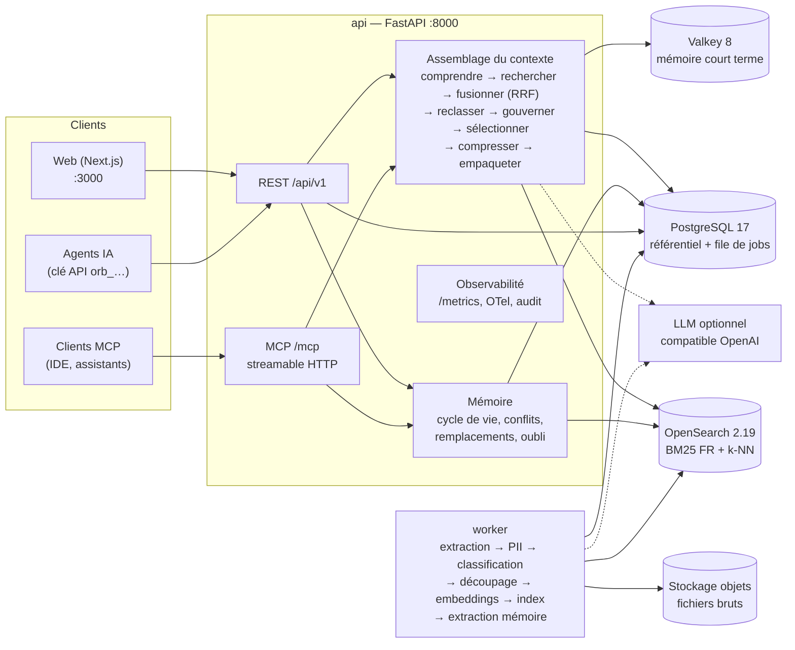

# ORBIT — Plateforme de contexte et de mémoire gouvernée pour agents IA

> **Le bon contexte, au bon agent, au bon moment — et la preuve de pourquoi.**

Les agents IA d'une équipe produit (rédaction de spécifications, design, ingénierie) échouent rarement faute de
modèle : ils échouent faute de **contexte fiable**. Ils citent une décision remplacée depuis un mois, mélangent deux
versions d'une spécification, ignorent une contrainte d'accessibilité ou, pire, exposent un document confidentiel à
un stagiaire.

**ORBIT** est la couche de contexte de l'entreprise pour ses agents :

- **Ingère** les sources de l'équipe (comptes rendus, spécifications versionnées, tickets, CRM, retours
  utilisateurs, traces d'agents, pages web) avec détection et caviardage des **données personnelles**.
- **Construit une mémoire vivante** : décisions, besoins, contraintes, risques et préférences extraits
  automatiquement, avec cycle de vie (proposé → validé → remplacé / obsolète / oublié), versions et provenance
  jusqu'au paragraphe source.
- **Assemble un contexte gouverné** pour chaque tâche d'agent : recherche hybride, fraîcheur, résolution des
  conflits, dédoublonnage, habilitations et ACL, budget de tokens — chaque élément retenu ou exclu porte un
  **code de raison** explicable.
- **Partage un contexte commun** entre agents grâce aux **snapshots** versionnés et comparables (diff).
- **Mesure tout** : latence p95, tokens, coût estimé, exclusions par raison, sources les plus utiles, feedback ;
  export NDJSON des traces pour l'évaluation.
- S'intègre à n'importe quel agent via une **API REST** et un **serveur MCP** (streamable HTTP).

Le projet de démonstration **Atlas** (entreprise fictive *Nordalis*) raconte un vrai projet : une décision
« application native » remplacée par une « PWA », une spécification en deux versions, un inventaire qui contredit la
v2, des tickets périmés, un budget classifié **C3 (Secret)**, des fiches CRM **C2 (Confidentiel)** avec données
personnelles caviardées. Le scénario de présentation est décrit dans [`docs/DEMO.md`](docs/DEMO.md).

> ⚠️ **Classification des données.** ORBIT applique la politique de classification C0 (Public) → C3 (Secret).
> Le jeu de démonstration contient volontairement des contenus **C2 — Confidentiel** et **C3 — Secret**
> *entièrement fictifs*. N'y mélangez jamais de vraies données ; l'interface affiche un bandeau d'avertissement dès
> qu'un contenu C2/C3 est ingéré, affiché ou servi.

---

## Architecture



| Service | Rôle | Port hôte |
|---|---|---|
| `web` | Interface Next.js 15 (vue projet, sources, mémoire, explorateur, snapshots, observabilité, paramètres) | 3000 |
| `api` | FastAPI : REST `/api/v1`, MCP `/mcp`, `/metrics`, `/health`, `/ready` | 8000 |
| `worker` | Pipeline d'ingestion, consolidation mémoire, oubli sélectif (file Postgres `SKIP LOCKED`) | — |
| `postgres` | Source de vérité (documents, versions, chunks, mémoire, requêtes, snapshots, audit) | 5433 |
| `opensearch` | Recherche plein texte (analyseur français) + vecteurs k-NN | 9201 |
| `valkey` | Tampon des sessions d'agents (mémoire court terme, TTL) | 6380 |

Le contrat complet (déploiement, modèle d'accès, modèle de données, pipeline, algorithme d'assemblage) est dans
[`docs/ARCHITECTURE.md`](docs/ARCHITECTURE.md).

---

## Démarrage rapide

Prérequis : Docker (Compose v2) et `make`. Le modèle d'embeddings multilingue est téléchargé au build de l'image
backend ; la plateforme fonctionne ensuite **hors ligne** et **sans LLM**.

```bash
cp .env.example .env      # valeurs de développement
make up                   # construit et démarre toute la plateforme
make seed                 # charge le projet de démonstration « Atlas » via le vrai pipeline
```

`make seed` exécute `python -m app.seed` dans le conteneur `api` : il crée les utilisateurs, le projet, les agents et
les sources, ingère 11 documents (dont une spécification en deux versions) et 28 enregistrements importés
(Jira, CRM, bêta, traces d'agents), attend que le worker ait tout traité, crée la mémoire de démonstration, joue ~30 requêtes de contexte réelles avec leurs feedbacks et
snapshots, puis répartit leurs horodatages sur 14 jours (données de démonstration). Il est **idempotent** ;
`docker compose exec api python -m app.seed --reset` repart de zéro.

| URL | Description |
|---|---|
| http://localhost:3000 | Interface web |
| http://localhost:8000/api/v1/docs | Documentation OpenAPI interactive |
| http://localhost:8000/mcp | Serveur MCP (streamable HTTP, clé d'agent requise) |
| http://localhost:8000/metrics | Métriques Prometheus |
| http://localhost:8000/health · `/ready` | Sondes de vie et de disponibilité |

### Comptes de démonstration

| Personne | Email | Mot de passe | Rôle projet | Habilitation |
|---|---|---|---|---|
| Admin ORBIT | `admin@orbit.local` | `orbit-admin` | admin plateforme | C3 |
| Camille Martin — Product Owner | `camille.martin@nordalis.example` | `orbit-demo` | owner | C2 |
| Léo Bernard — Product Designer | `leo.bernard@nordalis.example` | `orbit-demo` | editor | C1 |
| Inès Moreau — Lead Engineer | `ines.moreau@nordalis.example` | `orbit-demo` | editor | C2 |
| Sarah Nguyen — Analyste (stagiaire) | `sarah.nguyen@nordalis.example` | `orbit-demo` | viewer | C1 |

Les clés des trois agents (`Agent Produit` C2, `Agent Design` C1, `Agent Engineering` C2) sont affichées à la fin du
seed et écrites dans `backend/.seed-agents.json` (fichier local, à ne pas versionner).

### Autres commandes

| Commande | Effet |
|---|---|
| `make logs` / `make ps` | Journaux / état des services |
| `make down` | Arrête la plateforme (volumes conservés) |
| `make reset` | Détruit les volumes et redémarre de zéro |
| `make infra` puis `make dev-backend`, `make dev-worker`, `make dev-frontend` | Développement sur l'hôte |
| `make test` / `make lint` | Tests et lint backend |

---

## Connecter un agent

### Serveur MCP

Chaque agent possède une clé API (`orb_<préfixe>_<secret>`, seule son empreinte est stockée) rattachée à un projet.
Exemple de configuration pour un client MCP compatible *streamable HTTP* :

```json
{
  "mcpServers": {
    "orbit-atlas": {
      "type": "http",
      "url": "http://localhost:8000/mcp",
      "headers": {
        "X-Orbit-Key": "orb_xxxxxxxx_remplacez-par-la-cle-de-l-agent"
      }
    }
  }
}
```

L'en-tête `Authorization: Bearer orb_…` est également accepté. L'écran **Paramètres → Agents** permet de copier cette
configuration. Outils exposés :

| Outil | Description |
|---|---|
| `get_context(task, intent?, token_budget?, scopes?, on_behalf_of?, session_id?, base_snapshot?, save_snapshot?)` | Contexte gouverné en Markdown avec citations `[S1]…`, compteurs d'exclusion, `request_id` |
| `get_snapshot(name, version?)` | Contexte commun enregistré (`latest` par défaut) |
| `search_sources(query, limit?)` | Recherche hybride filtrée par les droits de l'agent |
| `propose_memory(kind, title, content, scope?, provenance_document_ids?)` | Proposition de mémoire (statut `proposed`, à valider par un humain) |
| `record_turn(session_id, role, content)` | Mémoire court terme de session |
| `send_feedback(request_id, rating, comment?)` | Évaluation du contexte reçu |

### API REST

```bash
curl -s http://localhost:8000/api/v1/projects/atlas/context \
  -H "X-Orbit-Key: $ORBIT_KEY" -H "Content-Type: application/json" \
  -d '{"task": "Rédiger la spécification du module de réservation pour le pilote de Lyon",
       "token_budget": 4000, "on_behalf_of": "<uuid de Camille>"}'
```

Référence complète : [`docs/API.md`](docs/API.md) et la documentation OpenAPI (`/api/v1/docs`).

---

## Configuration

Variables d'environnement préfixées `ORBIT_` (voir [`.env.example`](.env.example) et
[`docs/ARCHITECTURE.md` §1](docs/ARCHITECTURE.md)).

| Variable | Défaut | Rôle |
|---|---|---|
| `ORBIT_DATABASE_URL` / `ORBIT_OPENSEARCH_URL` / `ORBIT_VALKEY_URL` | services Compose | Infrastructure |
| `ORBIT_JWT_SECRET` | valeur de dev | **Obligatoire en production** (≥ 32 caractères) |
| `ORBIT_COOKIE_SECURE` | `false` | `true` derrière HTTPS |
| `ORBIT_EMBEDDING_PROVIDER` | `fastembed` | `fastembed` (local, hors ligne), `openai` (TEI, vLLM, LiteLLM… via `ORBIT_EMBEDDING_BASE_URL` / `_API_KEY`), `hash` (tests) |
| `ORBIT_EMBEDDING_MODEL` / `ORBIT_EMBEDDING_DIM` | `paraphrase-multilingual-MiniLM-L12-v2` / `384` | Modèle et dimension (doivent correspondre) |
| `ORBIT_RERANKER` | `heuristic` | `heuristic`, `fastembed` (cross-encoder multilingue) ou `none` |
| `ORBIT_LLM_BASE_URL` / `ORBIT_LLM_MODEL` / `ORBIT_LLM_API_KEY` | vide | LLM **optionnel** compatible OpenAI (vLLM, Ollama, LiteLLM). Sans LLM, tout fonctionne en mode déterministe |
| `ORBIT_OTLP_ENDPOINT` | vide | Export OpenTelemetry (Langfuse, Jaeger, Tempo…) |
| `ORBIT_COST_PER_1K_TOKENS` | `0.002` | Estimation du coût (EUR) des contextes servis |
| `ORBIT_BOOTSTRAP_ADMIN_EMAIL` / `_PASSWORD` | `admin@orbit.local` / `orbit-admin` | Administrateur créé au premier démarrage |

Les politiques de fraîcheur par type de source, le budget de tokens par défaut, le seuil de pertinence et la durée
de vie de la mémoire court terme se règlent **par projet** (écran Paramètres).

---

## Modèle de sécurité

- **Identités** : utilisateurs (argon2, session JWT en cookie `httpOnly` SameSite=Lax) et agents (clé API par agent,
  empreinte SHA-256 seule stockée, rotation et révocation). Un agent agit **pour le compte** d'un membre du projet
  (`on_behalf_of`) ; sans cela il n'accède qu'aux contenus ouverts à tout le projet.
- **Rôles projet** : `owner` ⊃ `editor` ⊃ `viewer` ; `is_admin` pour l'administration de la plateforme.
- **Classification C0–C3** alignée sur la politique de l'organisation : un contenu n'est servi que si
  `classification ≤ min(habilitation utilisateur, habilitation agent, plafond de la requête)`.
- **ACL de contenu** (`project:*`, `role:owner`, `user:<id>`) sur documents, chunks et mémoire ; la mémoire dérivée
  hérite de l'ACL la plus restrictive et de la classification maximale de ses sources.
- **Non-fuite** : les exclusions pour ACL ou classification sont journalisées mais **caviardées** (ni titre, ni extrait,
  ni identifiant) pour qui n'a pas lui-même accès ; les agents ne reçoivent que des compteurs.
- **Données personnelles** : détection à l'ingestion (email, téléphone, IBAN, carte avec Luhn, NIR, IPv4, noms) ; le
  contexte servi utilise **toujours** le texte caviardé.
- **Oubli sélectif** (RGPD) : tombstone, retrait de l'index, contenu effacé, propagation aux éléments dérivés et aux
  snapshots, audit.
- **Audit** : chaque action sensible (ingestion, changement d'ACL ou de classification, oubli, contexte servi, export)
  est tracée ; les détails restreints ne sont visibles que des owners et admins.

---

## Tests

```bash
make infra                # postgres, opensearch, valkey
make test                 # suite backend (pytest, embeddings « hash » déterministes)
make lint                 # ruff
cd frontend && npm run typecheck && npm run lint
```

Les tests d'intégration créent une base et des index dédiés (`ORBIT_TEST_DATABASE`, `ORBIT_TEST_INDEX_PREFIX`,
`ORBIT_TEST_VALKEY_URL`) et n'affectent jamais les données de la plateforme. Le jeu de démonstration est lui-même
testé : cohérence manifeste ↔ fichiers, dates relatives, couverture de chaque mécanisme de `docs/DEMO.md`, et
exécution complète du seed contre une API simulée (`tests/test_seed_data*.py`).

---

## Organisation du dépôt

```
orbit/
  docker-compose.yml  Makefile  .env.example  README.md
  docs/               ARCHITECTURE.md (contrat), API.md (API REST + MCP), DEMO.md (jeu et scénario)
  backend/            FastAPI + worker (Python 3.12, uv)
    app/api/          routers REST
    app/ingestion/    extracteurs, PII, classification, découpage, importeurs JSON/CSV, pipeline
    app/search/       embeddings, OpenSearch, recherche hybride BM25 + k-NN + RRF, reranking
    app/memory/       extraction, cycle de vie, conflits, court terme (Valkey)
    app/governance/   politique et codes de raison, ACL, fraîcheur
    app/context/      assembleur, sélection, compression, citations, snapshots
    app/observability/ métriques Prometheus, OpenTelemetry, enregistrement des requêtes
    app/mcp_server.py serveur MCP monté sur /mcp
    app/seed/         jeu de démonstration Atlas (data/manifest.json + fichiers) et chargeur
    tests/            pytest (unitaires + intégration)
  frontend/           Next.js 15 (App Router), TypeScript strict, Tailwind CSS v4, Radix UI, TanStack Query, Recharts
```

---

## État et feuille de route

**Disponible** : ingestion multi-sources avec versions et PII, mémoire à cycle de vie complet, assemblage de contexte
gouverné et explicable, snapshots et diff, observabilité (vue projet, métriques, export NDJSON), audit, API REST,
serveur MCP, interface web, jeu de démonstration de bout en bout. LLM et reranker neuronal sont des **options** :
sans eux, ORBIT fonctionne en mode déterministe (règles, extraction, heuristiques).

**Feuille de route**

| Sujet | Description |
|---|---|
| Graphe de connaissances | Spike : relations mémoire ↔ documents exploitées au classement (parcours multi-sauts) |
| Connecteurs | Synchronisation continue Jira, Confluence, SharePoint, Teams, CRM (aujourd'hui : import JSON/CSV, upload, texte) |
| Stockage objets | Backend S3 / compatible S3 derrière l'abstraction `ObjectStore` (aujourd'hui : volume local) |
| Identité d'entreprise | Keycloak / OIDC pour les utilisateurs (option entreprise) |
| Autorisation externalisée | OpenFGA (ReBAC) pour les ACL, OPA pour les politiques de classification et de fraîcheur |
| Évaluation | Boucle d'évaluation continue à partir des exports NDJSON et des feedbacks |
